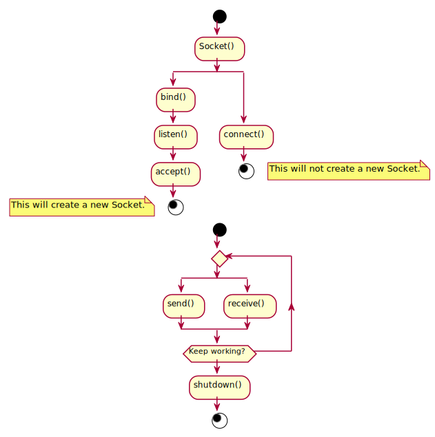
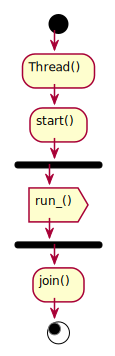
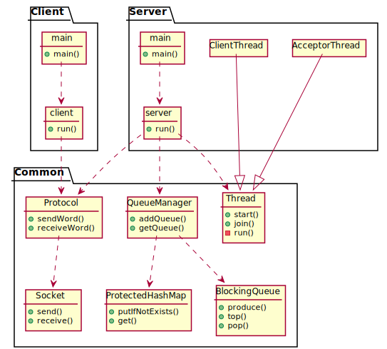

# Taller de Programación I - Ejercicio 3 - My Little Middleware
Nicolás De Giácomo\
99702

## Contenido
* [1. Introducción](#1-introducción)
* [2. Módulos y TDAs](#2-módulos-y-tdas)
    * [2.1. TDA: BlockingQueue](#21-tda-blockingqueue)
        * [2.1.1. Introducción](#211-introducción)
        * [2.1.2. Funciones Principales](#212-funciones-principales)
    * [2.2. TDA: ProtectedHashMap](#22-tda-protectedhashmap)
        * [2.2.1. Introducción](#221-introducción)
        * [2.2.2. Funciones Principales](#222-funciones-principales)
    * [2.3. TDA: Protocol](#23-tda-protocol)
        * [2.3.1. Introducción](#231-introducción)
        * [2.3.2. Funciones Principales](#232-funciones-principales)
    * [2.4. TDA: Socket](#24-tda-socket)
        * [2.4.1. Introducción](#241-introducción)
        * [2.4.2. Funciones Principales](#242-funciones-principales)
        * [2.4.3. Diagrama de Utilización](#243-diagrama-de-utilización)
    * [2.5. TDA: Thread](#25-tda-thread)
        * [2.5.1. Introducción](#251-introducción)
        * [2.5.2. Funciones Principales](#252-funciones-principales)
        * [2.5.3. Diagrama de Utilización](#253-diagrama-de-utilización)
    * [2.6. Módulos: Client y Server](#26-módulos-client-y-server)
        * [2.6.1. Introducción](#261-introducción)
        * [2.6.2. Funciones Principales](#262-funciones-principales)
* [3. Esquema Final](#3-esquema-final)
* [4. Recursos](#4-recursos)

## 1. Introducción
En este proyecto se diseña una versión simplificada de un middleware, más específicamente un MOM (Message Oriented Middleware).\
Este middleware permitirá crear y utilizar colas de mensajes por distintos clientes.

También se implementará el módulo de los clientes, que leerá información ingresada por el usuario en la terminal y operará sobre el middleware (en el servidor) apropiadamente.

## 2. Módulos y TDAs
La decisión sobre el armado de cada módulo o TDA se corresponde con la identificación de cierto comportamiento que puede ser encapsulado.
De esta manera se evita que otras partes del código tengan que conocer y/o controlar lógicas externas a su función.

### 2.1. TDA: BlockingQueue
#### 2.1.1 Introducción
Utilizando `std::mutex`, `std::condition_variable` y `std::queue`, este TDA encapsula el comportamiento de una cola bloqueante que se puede utilizar de manera _thread-safe_.\
Una cola bloqueante detiene la ejecución de un hilo hasta que la acción deseada (agregar o quitar de la cola) pueda ser ejecutada.

Este TDA se diseñó de manera `Exception Safe Strong`.

#### 2.1.2 Funciones Principales
A continuación se muestran las funciones principales para este TDA.

```c++
BlockingQueue<T>::BlockingQueue();
```
Este TDA utiliza un _template_ `template<typename T>` que determina el tipo del objeto que guardará internamente.

```c++
void BlockingQueue<T>::produce(const T &e);
```
El método `produce` ingresa un elemento a la cola. El mismo se recibe por parámetro.

```c++
T BlockingQueue<T>::top();
```
El método `top` devuelve el siguiente elemento de la cola.

```c++
T BlockingQueue<T>::pop();
```
El método `pop` remueve el siguiente elemento de la cola.

```c++
void BlockingQueue<T>::close();
```
El método `close` cierra la cola.\
Cuando entra en este estado, una cola dejará de aceptar nuevos elementos y **luego de vaciarse** tampoco aceptará nuevos consumos.

### 2.2. TDA: ProtectedHashMap
#### 2.2.1 Introducción
Este TDA representa un HashMap protegido, de manera de que se pueda utilizar de una forma `thread-safe`.

#### 2.2.2 Funciones Principales
A continuación se muestran las funciones principales para este TDA.

```c++
ProtectedHashMap<K, V>::ProtectedHashMap();
```
Este TDA utiliza un _template_ `template<typename K, typename V>` con dos tipos, que determina lo que va a contener en su interior.
El tipo `typename K` es el tipo asociado con las _keys_ del mapa, y el `typename V` el tipo asociado con los _values_.

```c++
bool ProtectedHashMap<K, V>::putIfNotExists(K key, V const &value);
```
Este método ingresa un nuevo elemento al mapa, si la clave aún no existe dentro del mismo. Se retorna _true_ si se ingresó el elemento y _false_ si se omitió la operación.

```c++
V ProtectedHashMap<K, V>::get(const K key) const;
```
Este método retorna el valor asociado a la clave que recibe por parámetro. Si la clave no se encuentra en el mapa se lanza una excepción de tipo `std::out_of_range`.

```c++
void ProtectedHashMap<K, V>::forEach(void func(V));
```
Este método aplica una función (que recibe por parámetro) a cada uno de los valores guardados en el mapa, de forma secuencial.
La función recibida debe tener una firma acorde: retornar `void` y recibir un solo parámetro del tipo configurado a través de `typename V`.

### 2.3. TDA: Protocol
#### 2.3.1 Introducción
Este TDA encapsula el protocolo de comunicación entre el servidor y los clientes.\
Este protocolo se basa en el envío y recepción de los siguientes elementos:
- Un comando, en forma de `char`.
- Una palabra, con su largo asociado.

#### 2.3.2 Funciones Principales
A continuación se muestran las funciones principales para este TDA.

```c++
Protocol::Protocol(Socket socket);
```
En su constructor, este TDA recibe un Socket. 
Este Socket pertenece al [TDA: Socket](#24-tda-socket) y se utilizará en todo tipo de comunicación que el protocolo realice. 

```c++
void Protocol::sendCommand(char c) const;
char Protocol::getCommand() const;
```
Estos métodos envían o reciben un **comando** que se representa con un _char_.

```c++
void Protocol::send_word(const std::string& word) const;
std::string Protocol::get_word() const;
```
Estos métodos envían o reciben una palabra.
Este envío o recepción se realiza en dos partes: primero se envía/recibe el largo de la palabra en **2 bytes**, y luego se envía/recibe la palabra en cuestíón.

### 2.4. TDA: Socket
#### 2.4.1 Introducción
Dentro del TDA Socket se encapsula la creación, utilización y eliminación de los sockets, como también la lectura y la escritura a través de una comunicación TCP/IP.

#### 2.4.2 Funciones Principales
A continuación se muestran las funciones principales para este TDA.

```c++
void Socket::bind(const char *port);
void Socket::listen(int size) const;
Socket Socket::accept() const;
```
Estos métodos se utilizan al momento de crear un servidor. Los primeros dos, crea un Socket en el puerto deseado y lo establece en modo _listen_ con una cola de espera de conexiones.\
El tercer método, acepta un cliente de la mencionada cola de conexiones y retorna nu **nuevo** Socket que permitirá la comunicación con el cliente.

```c++
void Socket::connect(const char* port, const char* name);
```
En caso contrario, se utilizará este método si se desea crear un cliente El mismo permite la conexión con un servidor, con el puerto y el servicio recibidos por parámetro.

```c++
void Socket::send(const char *buffer, unsigned int size) const;
void Socket::receive(char* buffer, unsigned int size) const;
```
Una vez establecida la conexión, se utilizarán estos métodos para enviar y recibir bytes.

#### 2.4.3 Diagrama De Utilización



### 2.5. TDA: Thread
#### 2.5.1 Introducción
Este TDA encapsula la manipulación de _threads_, y proporciona una interfaz sencilla para su utilización.

#### 2.5.2 Funciones Principales
A continuación se muestran las funciones principales para este TDA.

```c++
virtual void run_() = 0;
```
Este TDA está diseñado para ser implementado utilizando herencia.
Por lo tanto, sobre este método deberá hacerse un _override_, y su contenido será lo que se ejecute en el correspondiente hilo. 

```c++
void Thread::start();
void Thread::join();
```
Estas funciones son parte de la interfaz básica de un hilo, permiten comenzar y esperar el cierre de la ejecución correspondientemente.

#### 2.5.3 Diagrama De Utilización


### 2.6. Módulos: Client y Server
#### 2.6.1 Introducción
Finalmente, los módulos Client y Server utilizan los TDA mencionados anteriormente para realizar sun funciones.

El módulo Client lee comandos ingresados por el usuario por la entrada estándar y envía las acciones necesarias al servidor.
Los comandos que utiliza son los siguientes:
- define <queue>: Define una nueva Queue.
- push <queue> <message>: Agrega un mensaje a una Queue. 
- pop <queue>: Extrae un mensaje de una Queue.
- exit: Termina la ejecución del módulo.

El módulo Server contiene todas las Queues utilizadas por los clientes e intercambia información con los mismos. También lee de la entrada estándar, por la cual puede recibir un único parámetro: `q`.
Este parámetro detiene la ejecución del servidor.

#### 2.6.2 Funciones Principales
Ambos módulos exponen una única función `run_` que retorna los siguientes códigos.
- `0` si se ejecutó sin problemas
- `1` si hubo algún error en los parámetros.
- `2` si hubo algún otro error.

## 3. Esquema Final
Para completar el proyecto, se requiere de un archivo _main_ (uno para el servidor y otro para el cliente), que contenga la función del mismo nombre.
Su responsabilidad es el control y validación de los argumentos recibidos, antes de iniciar el módulo correspondiente.

Sabiendo esto, se puede plantear el esquema final, con las relaciones entre todos los módulos y TDA.



## 4. Recursos
Para el desarrollo de este proyecto se utilizaron los siguientes recursos.
- Diagramas
    - [Plant UML](https://plantuml.com/en/)
- Documentación
    - [Man](https://linux.die.net/man/)
    - [Man7](https://man7.org/index.html)
    - [CPPReference](https://en.cppreference.com/w/)
    - [CPlusPlus.com](https://www.cplusplus.com/doc/)
    - [Markdown](https://www.markdownguide.org/)
    - [Doxygen](https://www.doxygen.nl/index.html)
- Desarrollo
    - [CppCheck](https://cppcheck.sourceforge.io/)
    - [CppLint](https://github.com/cpplint/cpplint)
    - [Valgrind](https://www.valgrind.org/)
    - [ByExamples](https://byexamples.github.io/)
    - [Doctest](https://github.com/onqtam/doctest)
